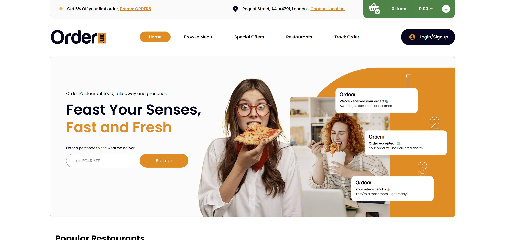

# FoodDeliveryWebsite
A web application for ordering food, built with ASP.NET. This project was developed as part of a university Database course, using the Database First approach. It includes user authentication, restaurant browsing, order placement, and separate panels for regular users and restaurant owners.

## Features

- User authentication and registration  
- Restaurant browsing  
- Order placement  
- Separate dashboards for users and restaurant owners

## Technologies

- ASP.NET MVC  
- Entity Framework (Database First)  
- SQL Server

## Notes

This app is **not fully complete** – it was developed to demonstrate selected features and the functionality of the database system for academic purposes.
